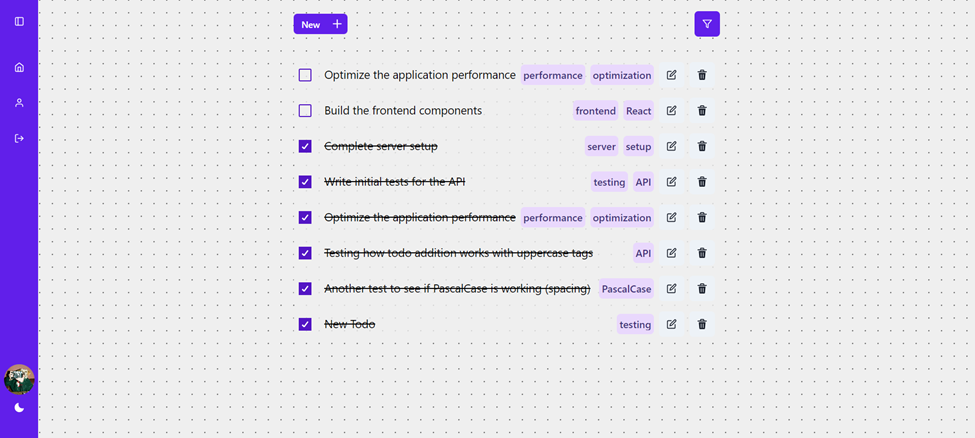

# Todo App with User Authentication

### Description

This is a full-stack Todo application that allows users to register, log in, and manage their tasks. The app uses JWT-based authentication, ensuring that only authenticated users can access their tasks. It implements CRUD operations for managing tasks and includes a responsive, user-friendly interface built with **React** and styled using **Chakra UI**. The backend is powered by **Node.js**, **Express**, and **MongoDB**.

### Features

- **User Authentication**: Users can register, log in, and access their profile information.
- **JWT-Based Authentication**: JSON Web Tokens (JWT) are used to protect routes, ensuring only authenticated users can access certain features.
- **CRUD Operations on Todos**: Users can create, read, update, and delete todos.
- **Dark/Light Mode Toggle**: The app supports dark and light modes, with a toggle feature.
- **Chakra UI for Responsive Design**: The app uses Chakra UI to provide a good user experience.
- **Protected Routes**: The app uses protected routes to ensure that users cannot access pages like the todo list or profile without logging in.

### Technologies Used

- **Frontend**: React, React Router, Chakra UI
- **Backend**: Node.js, Express, MongoDB, JWT
- **Authentication**: JWT (JSON Web Tokens) for secure authentication
- **API Integration**: Custom API for user authentication and todo management

### Screenshots


### Key Features

1. **User Registration and Login**:
   - Users can create a new account or log in with an existing account.
   - Passwords are hashed before storage for added security.
   
2. **Todo Management**:
   - Add, edit, and delete todos.
   - Mark tasks as completed or incomplete.

3. **Profile Page**:
   - Displays user details such as username and email.
   - Accessible only to authenticated users.

4. **Dark/Light Mode**:
   - Toggle between dark and light modes using the switch on the navigation bar.

### Installation

To run this project locally, follow these steps:

1. **Clone the repository**:
    ```bash
    git clone https://github.com/your-username/todo-app.git
    cd todo-app
    ```

2. **Install Dependencies**:
    - Install server dependencies:
      ```bash
      cd server
      npm install
      ```
    - Install client dependencies:
      ```bash
      cd client
      npm install
      ```

3. **Set Up Environment Variables**:
   Create a `.env` file in the server directory and include the following:
    ```env
    MONGO_URI=<your_mongodb_connection_string>
    JWT_SECRET=<your_jwt_secret>
    ```

4. **Run the Server**:
    - Navigate to the `server` folder and run the following:
      ```bash
      npm run dev
      ```
    - The backend server should be running at `http://localhost:5000`.

5. **Run the Client**:
    - Navigate to the `client` folder and run the following:
      ```bash
      npm run start
      ```

### API Endpoints

- **User Routes**:
  - `POST /api/register`: Register a new user
  - `POST /api/login`: Login a user
  - `GET /api/profile`: Get the current user's profile (requires authentication)

- **Todo Routes**:
  - `GET /api/todos`: Get all todos for the logged-in user (requires authentication)
  - `POST /api/todos`: Create a new todo (requires authentication)
  - `PUT /api/todos/:id`: Update an existing todo (requires authentication)
  - `DELETE /api/todos/:id`: Delete a todo (requires authentication)

### Demo

You can view a live demo of the app [here](#).


