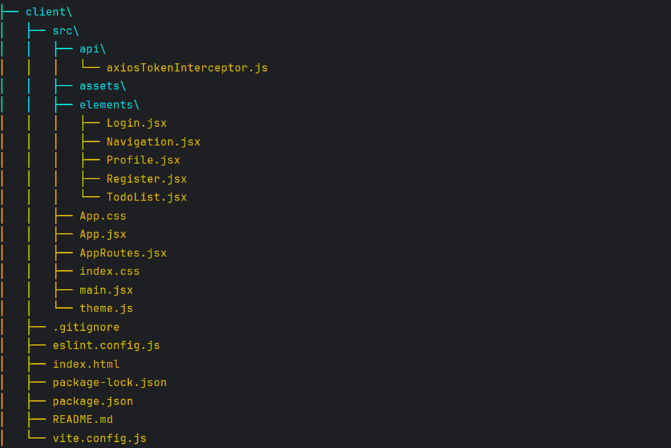
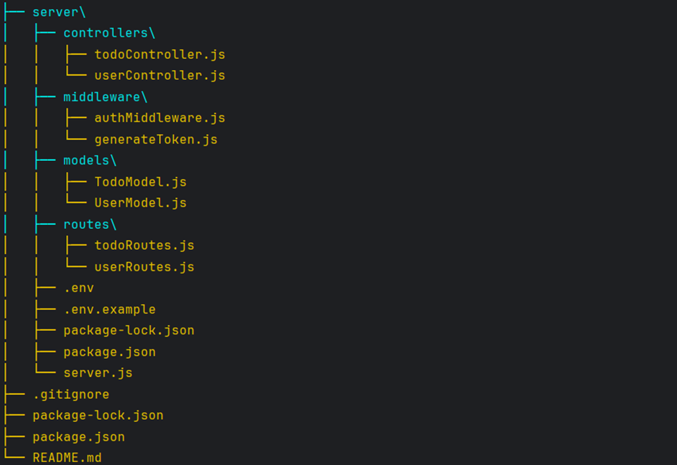
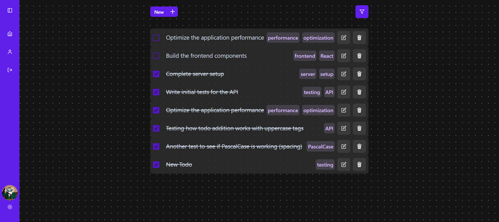
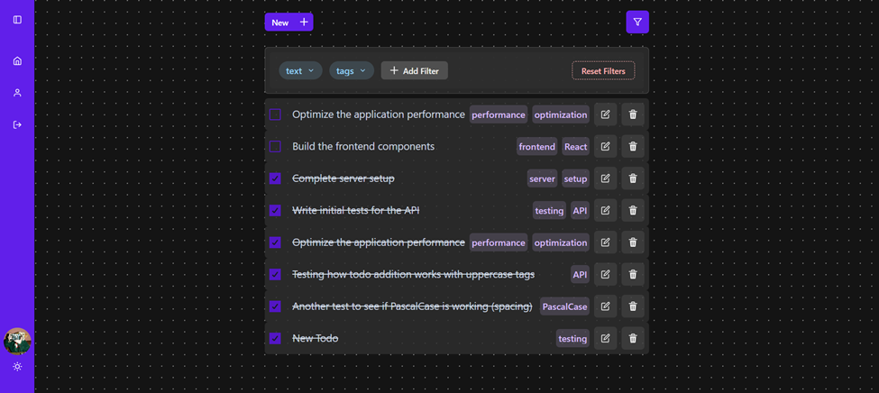

# Todo App with User Authentication

### Description

This is a full-stack Todo application that allows users to register, log in, and manage their tasks. The app uses JWT-based authentication, ensuring that only authenticated users can access their tasks. It implements CRUD operations for managing tasks and includes a responsive, user-friendly interface built with **React** and styled using **Chakra UI**. The backend is powered by **Node.js**, **Express**, and **MongoDB**.

### Features

- **User Authentication**: Users can register, log in, and access their profile information.
- **CRUD Operations on Todos**: Users can create, read, update, and delete todos.
- **Task Filtering and Search** Filtering feature allows for a multi-criteria search on todos.
- **Tag Management**
- **Dark/Light Mode Toggle**: The app supports dark and light modes, with a toggle feature.
- **Chakra UI for Responsive Design**: The app uses Chakra UI to provide a good user experience.
- **Protected Routes**: The app uses protected routes to ensure that users cannot access pages like the todo list or profile without logging in.

### Technologies Used
- **API Integration**: created endpoints for:
  - user management
    - registration (endpoint for taking the user's details, hashing the password using bcrypt, and storing the user in the MongoDB database using mongoose)
    - login (endpoint to check if the user's credentials match any record in the database)
    - jwt verification (to protect sensitive routes: only logged in users can access specific parts of API)
  - todo items management (creation, fetching, update, deletion)

## Frontend
- UI components:
    - `@chakra-ui`: library that provides customizable components
- react frameworks:
  - `react`: fore building user interface
  - `react-dom`: for rendering react components to the DOM
  - `react-router-dom`: for managing navigation/routing in the application
- HTTP requests to the backend server: `axios`
- development utilities:
  - `vite`: for serving React application
## Backend
- server:
  - `express`: for building and handling server routes and middleware
- database:
  - `mongoose`: for interacting with MongoDB using schemas
- authentication:
  - `jsonwebtoken`: for secure json token based authentication 
  - `bcrypt`: for password hashing
- environment management:
  - `dotenv`: for managing environment variables
- development utilities:
  - `nodemon`: for automatic server restart when code changes during development
## General
- `concurrently`: for running multiple npm scripts (e.g., frontend and backend servers) simultaneously.

### Screenshots
Light mode:


Dark mode:


Adding a filter:


### Key Features

1. **User Registration and Login**:
   - Users can create a new account or log in with an existing account.
   - Passwords are hashed before storage for added security.
   
2. **Todo Management**:
   - Add, edit, and delete todos.
   - Mark tasks as completed or incomplete.
   
3. **Task Filtering and Search**:
   - Users can filter tasks based on multiple criteria such as task text, tags, and completion status.
   - Supports dynamic filtering, with dropdown menus and tag search.

4. **Tag Management**:
   - Users can add multiple tags to a task and filter tasks by specific tags.
   - The app auto-generates a list of available tags for users to choose from.
   
5. **Profile Page**:
   - Displays user details such as username and email.
   - Accessible only to authenticated users.

5. **Dark/Light Mode**:
   - Toggle between dark and light modes using the switch on the navigation bar.


### Folder structure 
The project is organized into two main sections: client and server. This structure represents a full-stack application, where the client folder contains the front-end code (React application) and the server folder contains the back-end code (Node.js + Express server).
Client folder:

- elements/: stores React components that form the building blocks of the user interface (UI).
- api/: contains files that handle API requests
  - `axiosTokenInterceptor.js` inside of api/ includes logic for adding authentication tokens (jwt tokens) to outgoing requests for secure communication between the frontend and backend.

Server folder:

- controllers/: Contains controller functions for handling API requests related to users and todos.
- middleware/: Holds middleware functions, such as authentication, that are executed during request processing.
- models/: This folder contains Mongoose models representing the MongoDB collections (e.g., User, Todo).
- node_modules/: Holds all the npm dependencies for the back-end.
- routes/: Contains the route definitions for various API endpoints, including user authentication and todo operations.
### Installation

To run this project locally, follow these steps:

1. **Clone the repository**:
```bash
    git clone https://github.com/hanna-melnyk/todo.git
    cd todo
```

2. **Install Dependencies**:
 Install server dependencies:
```bash
   cd server
   npm install
```
   
Install client dependencies:
```bash
    cd client
    npm install
```

3. **Set Up Environment Variables**:

- The JWT (JSON Web Token) secret is a crucial part of your authentication system. It is used to sign and verify tokens. To ensure security, the JWT secret should be a long, complex string of random characters. This will make it difficult for attackers to guess or brute force. You can generate a random string for your JWT secret using the following command in your PowerShell terminal:
```powershell
[Convert]::ToBase64String((1..32 | ForEach-Object { [byte](Get-Random -Minimum 0 -Maximum 256) }))

```
- You can create a free MongoDB database by following the steps on the official MongoDB website:
[Create MongoDB Database](https://www.mongodb.com/)

After generating jwt secret and creating a database it's time to set them as environmental variables. 

Create a `.env` file in the server directory and include the following:
```env
MONGO_URI=<your_mongodb_connection_string>
JWT_SECRET=<your_jwt_secret>
```

4. **Run the Server**:
Navigate to the `server` folder and run the following:
```bash
      npm run dev
```
The backend server should be running at `http://localhost:5000`.

5. **Run the Client**:
Navigate to the `client` folder and run the following:
```bash
      npm run start
```

### API Endpoints

- **User Routes**:
  - `POST /api/register`: Register a new user
  - `POST /api/login`: Login a user
  - `GET /api/profile`: Get the current user's profile (requires authentication)

- **Todo Routes**:
  - `GET /api/todos`: Get all todos for the logged-in user (requires authentication)
  - `POST /api/todos`: Create a new todo (requires authentication)
  - `PUT /api/todos/:id`: Update an existing todo (requires authentication)
  - `DELETE /api/todos/:id`: Delete a todo (requires authentication)

### Demo

You can view a live demo of the app [here](https://todo-server-d87t.onrender.com).

**Note:** Deployment is yet to be done in the future.

